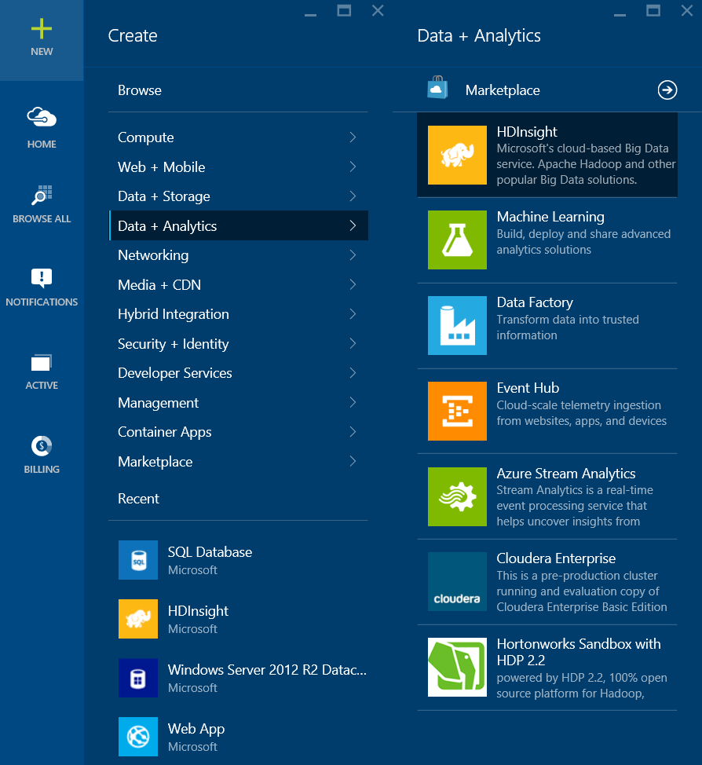
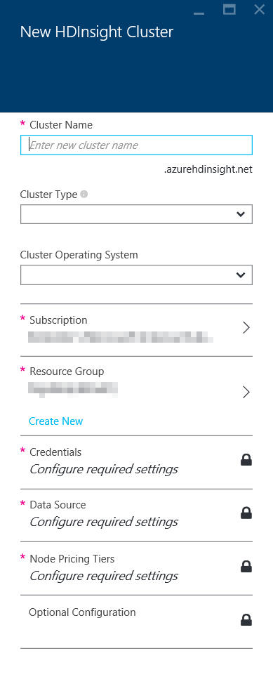
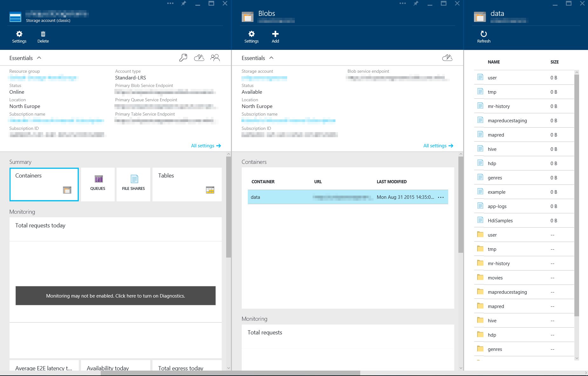
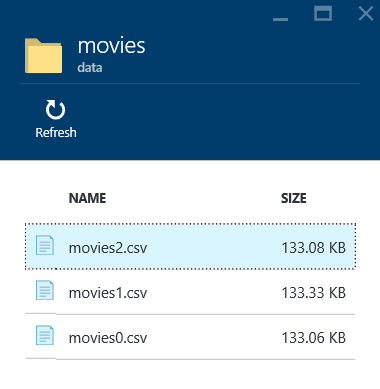
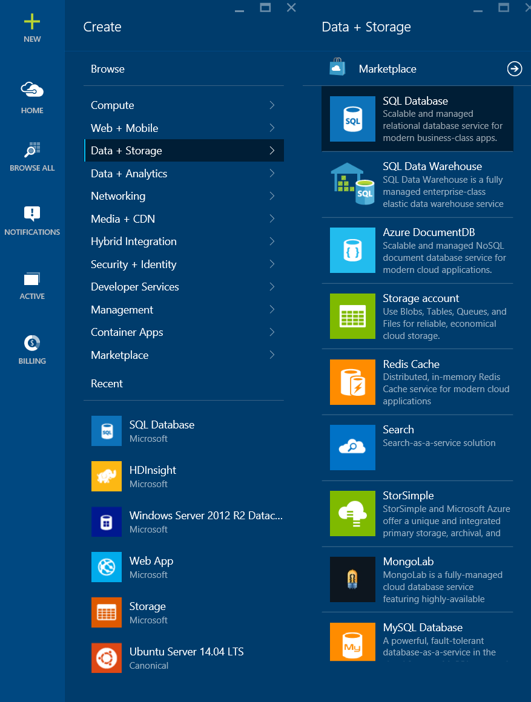
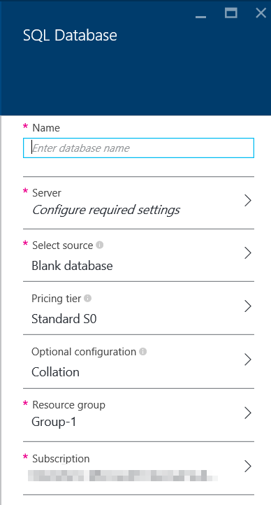

#Using HDInsight (Hadoop) together with Scoop to query data and transfer the results to SQL Database

##Content##
  1. **Prerequisites**
  2. **What is HDInsight, Hadoop and Scoop?**
  3. **What are we trying to accomplish?**
  4. **Provision an HDInsight Cluster**
  5. **Getting Data into HDInsight**
  6. **Using HDInsight to query the uploaded data**
  7. **Exporting data to SQL Database**
  8. **Conclusion**

This tutorial is bases on and in many ways similar to other tutorials on the [Azure Website](http://azure.com). Specifically, much influences have been taken from:

  * [Hdaoop tutorial: Get started using Hadoop with Hive in HDInsight on Linux](https://azure.microsoft.com/en-us/documentation/articles/hdinsight-hadoop-linux-tutorial-get-started/)
  * [Use Sqoop with Hadoop in HDInsight (SSH)](https://azure.microsoft.com/en-us/documentation/articles/hdinsight-use-sqoop-mac-linux/)

##1. Prerequisites

Before you begin this tutorial, you must have the following:

  * Data! The data used in this lab is based on Movie information, but could easily be changed to use any kind of information. If this lab is used during a trainer led lab, then make sure you contact your trainer for information about where the data can be found.
  * An Azure subscription. See [Get Azure free trial](http://azure.microsoft.com/documentation/videos/get-azure-free-trial-for-testing-hadoop-in-hdinsight/).
  * Secure Shell (SSH) keys. If you want to remote into a Linux cluster by using SSH with a key instead of a password. Using a key is the recommended method as it is more secure. For instructions on how to generate SSH keys, refer to the following articles:
    * From a Linux computer - [Use SSH with Linux-based HDInsight (Hadoop) from Linux, Unix, or OS X](https://azure.microsoft.com/en-us/documentation/articles/hdinsight-hadoop-linux-use-ssh-unix/).
    * From a Windows computer - [Use SSH with Linux-based HDInsight (Hadoop) from Windows](https://azure.microsoft.com/en-us/documentation/articles/hdinsight-hadoop-linux-use-ssh-windows/).
  * Azure CLI (a.k.a. Azure Xplat CLI) [installed and configured](https://azure.microsoft.com/en-us/documentation/articles/xplat-cli/) on your Azure subscription

##2. What is HDInsight, Hadoop and Scoop?

###What is Hadoop in HDInsight?

*"Azure HDInsight deploys and provisions Apache Hadoop clusters in the cloud, providing a software framework designed to manage, analyze, and report on big data with high reliability and availability. HDInsight uses the Hortonworks Data Platform (HDP) Hadoop distribution. Hadoop often refers to the entire Hadoop ecosystem of components, which includes Storm and HBase clusters, as well as other technologies under the Hadoop umbrella. See Overview of the Hadoop ecosystem on HDInsight below for details."*

Source: [Introduction to Hadoop in HDInsight: Big-data analysis and processing in the cloud](https://azure.microsoft.com/en-us/documentation/articles/hdinsight-hadoop-introduction/)

###What is Sqoop?

*"Although Hadoop is a natural choice for processing unstructured and semi structured data, such as logs and files, there may also be a need to process structured data that is stored in relational databases.*

*[Sqoop](https://sqoop.apache.org/docs/1.4.4/SqoopUserGuide.html) is a tool designed to transfer data between Hadoop clusters and relational databases. You can use it to import data from a relational database management system (RDBMS) such as SQL Server, MySQL, or Oracle into the Hadoop distributed file system (HDFS), transform the data in Hadoop with MapReduce or Hive, and then export the data back into an RDBMS."*

Source: [Use Sqoop with Hadoop in HDInsight (SSH)](https://azure.microsoft.com/en-us/documentation/articles/hdinsight-use-sqoop-mac-linux/)

##3. What are we trying to accomplish?

This tutorial will not:

* Give you a full training on all things Azure
* Make you a HDInsight/Hadoop Expert
* ... (many other things go here)

This tutorial will:

* Give you a brief input into Big Data Analysis using HDInsight in Azure
* Show you how tools like Sqoop can be used to combine services like HDInsight with SQL Database by exporting or importing data

##4. Provision an HDInsight Cluster

  1. Sign in to the [Azure Portal](https://portal.azure.com)
  
  2. Click NEW -> Data + Analytics -> HDInsight
  
  
  
  3. Go through all the options you need to provide in the following dialog
  
  
  
  * Cluster Name - A unique name that you give to your cluster. You'll use this name, together with the domain azurehdinsight.net, to access your cluster later on.

  * Cluster Type - For this tutorial we will use a Hadoop cluster. Select Hadoop.

  * Cluster Operating System - This tutorial uses a Linux based Hadoop Cluster. Select Ubuntu 12.04 LTS.

  * Subscription - If you have several Azure subscriptions connected to you, you can select what subscription you want to use. Select the subscription you want to use.

  * Resource Group - Group your resources in an already existing resource group or create a new one by providing a unique name. Read more about Resource Groups [here](https://azure.microsoft.com/en-us/documentation/articles/resource-group-portal/). 

  * Credentials - Fill in the usernames and passwords you want to use to access your cluster.

  * Cluster Login Username/Password is used to remotely manage and logon to your cluster dashboard.

  * SSH Username/Password is used when connecting to the cluster using SSH. This tutorial will make use of SSH connections using Password as SSH Authentication Type. Please see the "Prerequisites" for links to where you can learn about how to connect using keys instead.

  * Data Source - Your cluster will input and output data as we execute jobs against it. Configure your default data source here.

    * Select Storage Account - Create a new storage account or use an existing one as your default data source. All storage accounts have globally unique names.

    * Choose Default Container - A container can be seen as a folder inside a Blob Storage Account. Give your container a name. In this tutorial we will use the name: data.

    * Location - Select a location of your data source by picking a location from the list. This location will also select the location of your HDInsight Cluster.    

  * Node Pricing Tiers - Go into the Node Pricing Tiers and select the number and sizes you want to use of your HDInsight cluster. For this tutorial you could settle with a very small cluster, but as always, more and bigger machines will be faster. Do any changes you want or stick with the default for now.

  4. Make sure you are satisfied with your settings (and remember usernames and passwords) and then click "Create" to start creation of the HDInsight Cluster.

##5. Getting Data into HDInsight

### Data Format used in this tutorial
While your cluster are getting provisioned we can start thinking about the data we want to use and how to get that data to Azure. The data we want to use during this tutorial should have the following format:

  * Should be one or more ASCII text files containing information about movies.
  * Data in files should be separated using the | character (pipe-character) and contain information that could be interpreted as:
    * Id (int)
    * Title (string)
    * Year (int)
    * Genre (string)
    * Spoken Language (string)
    * Vote Average (float)
    * Vote Count (int)
  
Sample:

    102629|El Gringo|2012|Adventure|es,en|4.7|21
    102629|El Gringo|2012|Thriller|es,en|4.7|21
    102631|Battlefield America|2012|Music|en|3.9|5
    102632|Rowdy Rathore|2012|Adventure|hi|5.1|8
    102634|La Cucaracha|1959|Drama|es|0.0|0

As you can see, can the same movie can be present several times if it's tagged using more than one genre, but even if several spoken languages are registered the movie will not be duplicated per language.

This tutorial presumes you've gotten your hands on three files named:

  * movies0.csv
  * movies1.csv
  * movies2.csv
  
If you don't have access to those files, you could easily create some small files yourself using your personal video library. In this lab is part of a trainer lead lab, then please ask your instructor for more information.

### Uploading data to Azure

There are many ways of communicating/working with Azure and one of them is using the Azure X-platform CLI (Azure CLI). Azure CLI is written using Node.JS and therefore works on any machine that supports any of the latest versions of Node.js. This lab will work on any operating system supporting a browser, Node.js and SSH, hence the screenshots might look somewhat different on different machines, but the concept and commands are the same. Same thing is true about the console window, PowerShell, terminal, bash or whatever it is called on the version of operating system you are using. This lab talks about the "terminal window" or in short "terminal" when we refer to the application/window that allows you to run text commands on your computer.

  * Open a terminal Window
  * Make sure you have installed the Azure CLI by writing:

        > azure

        info:             _    _____   _ ___ ___
        info:            /_\  |_  / | | | _ \ __|
        info:      _ ___/ _ \__/ /| |_| |   / _|___ _ _
        info:    (___  /_/ \_\/___|\___/|_|_\___| _____)
        info:       (_______ _ _)         _ ______ _)_ _
        info:              (______________ _ )   (___ _ _)
        info:
        info:    Microsoft Azure: Microsoft's Cloud Platform
        info:
        info:    Tool version 0.9.8
        help:
        help:    Display help for a given command
        help:      help [options] [command]
        help:
        help:    Log in to an Azure subscription using Active Directory. Currently, the user can login only via Microsoft organizational account
        help:      login [options] [username]
        help:
        help:    Log out from Azure subscription using Active Directory. Currently, the user can log out only via Microsoft organizational account
        help:      logout [options] [username]
        help:
        help:    Open the portal in a browser
        help:      portal [options]
        help:
        help:    Commands:
        help:      account        Commands to manage your account information and publish settings
        help:      config         Commands to manage your local settings
        help:      hdinsight      Commands to manage HDInsight clusters and jobs
        help:      mobile         Commands to manage your Mobile Services
        help:      network        Commands to manage your networks
        help:      sb             Commands to manage your Service Bus configuration
        help:      service        Commands to manage your Cloud Services
        help:      site           Commands to manage your Web Sites
        help:      sql            Commands to manage your SQL Server accounts
        help:      storage        Commands to manage your Storage objects
        help:      vm             Commands to manage your Virtual Machines
        help:
        help:    Options:
        help:      -h, --help     output usage information
        help:      -v, --version  output the application version
        help:
        help:    Current Mode: asm (Azure Service Management)

* If you get the above response you've just confirmed that you have Azure CLI installed. Next we will make sure you have connected to your account. Enter

        > azure account list
        
If you have successfully configured Azure-CLI you should see at least one subscription now and one of them should be current. If not, then make sure to follow the instructions in the following [article](https://azure.microsoft.com/en-us/documentation/articles/xplat-cli/). Now, let's get started uploading those files to Azure. As you went through the process of creating your HD Insight cluster, you also had to provide a Storage Account used for your data. We are going to use that account now to upload our files.

* Execute:

        > azure storage account list
        
        info:    Executing command storage account list
        + Getting storage accounts
        data:    Name               Type            Label  Location      Resource Group
        data:    -----------------  --------------  -----  ------------  ---------------------------
        data:    storageaccount1    Standard_RAGRS         West US       My-Named-Resource-Group
        data:    storageaccount2    Standard_LRS           North Europe  Default-Storage-NorthEurope
        info:    storage account list command OK 

* Locate the storage account that you selected to use in the list (it might only be one account). For this sample I'll be using "storageaccount1" as a sample storage account. Make sure you replace that name, with the name of your own storage account whenever it's used.

* In order to access a storage account you'll need: the name of the account and the storage account key. Let's have a look at our key for the storage account we want to use:

        > azure storage account keys list storageaccount1

        info:    Executing command storage account keys list
        + Getting storage account keys
        data:    Primary: 9RNBtj5gXUPGuJXaufdYdylsFrkeZXXXXXXXXXXXXXXXXXXXX528GzJKKeRn9H8wIPfFzEbJz3dkzr8ja0GGkw==
        data:    Secondary: WQI0iW8+hbRwClbGLTgX9DZaOsSXXXXXXXXXXXXXXXXXXXXLJwhANbN16yeVSHQRj+/UvdRBuXnlt3ONpCTy6w==
        info:    storage account keys list command OK

Both the primary and the secondary storage account keys are fully valid and will give you or anyone else full access rights to that particular storage account. Copy the primary key to "clip board" since we will use it next.
* Execute the following command to see containers inside a storage account. Make sure to replace the name of the storage account as well as the key:

        > azure storage container list -a <storageaccountname> -k <storageaccountkey>
        
        info:    Executing command storage container list
        + Getting storage containers
        data:    Name  Public-Access  Last-Modified
        data:    ----  -------------  -----------------------------
        data:    data  Off            Mon, 31 Aug 2015 12:35:07 GMT
        info:    storage container list command OK

You should see a response, similar to the above that tells us we have (in this example) only one container named "data". If you followed the above instructions and also named your default container to "data" you should see that one in the list.

* Time to upload the files that we want to work with to Azure Blob Storage. For each file, execute the following statement:

        > azure storage blob upload -a <storageaccountname> -k <storageaccountkey> [file] [container] [blob]
        
For example:
        
        > azure storage blob upload -a storageaccount1 -k 9RNBtj5gXUPGuJXaufdYdylsFrkeZXXXXXXXXXXXXXXXXXXXX528GzJKKeRn9H8wIPfFzEbJz3dkzr8ja0GGkw== movies0.csv data movies/movies0.csv
        > azure storage blob upload -a storageaccount1 -k 9RNBtj5gXUPGuJXaufdYdylsFrkeZXXXXXXXXXXXXXXXXXXXX528GzJKKeRn9H8wIPfFzEbJz3dkzr8ja0GGkw== movies1.csv data movies/movies1.csv
        > azure storage blob upload -a storageaccount1 -k 9RNBtj5gXUPGuJXaufdYdylsFrkeZXXXXXXXXXXXXXXXXXXXX528GzJKKeRn9H8wIPfFzEbJz3dkzr8ja0GGkw== movies2.csv data movies/movies2.csv
        
The above statement will upload a local file (in the current folder) named "movies0.csv" to the container called "data" and call the remote blob/file the same thing, namely "movies/movies0.csv". This will all take place in the storage account called "storageaccount1" and are authenticated using the provided key. Notify that we upload the files to a container named data and names the blob with something that looks like a folder (i.e. each file is named "movies/....csv"). We are going to use that "folder" to filter our input later on, so make sure you do the same.

Now, let's have a look at how our BLOBLS look like from the Azure Portal (even though you can also list and download files directly from Azure-CLI as well):

  * Open and logon to the [Azure Portal](https://portal.azure.com) if you are not already logged on.
  
  * In the portal, click on: BROWSE ALL and find your Storage Account from the list of existing resources. TIP! If you want to, you can limit the type of resources you are browsing be selecting the type in the list. Once you find your storage account, click on that.
  
  
  
  * Brows your storage account by clicking the Containers icon (shown above) and then drilling down into the "data" container. If your upload went well, you'll find your files in the "movies" folder.
  
    

##6. Using HDInsight to query the uploaded data

Before we continue, it's important that your cluster have had enough time to spin up. Have a look in the [Azure Portal](https://portal.azure.com) to make sure the cluster had finished provisioning.

### Connecting to the cluster using SSH

Back to the terminal, because we are about to connect to our HDInsight cluster using SSH. SSH Clients comes in different flavors and might look different on different platforms, but the fundamentals are the same:

 * Connect to your cluster using SSH using:
  * Address: `<sshusername>@<clustername>-ssh.azurehdinsight.net`
  
For example

        > ssh sshuser@mytestclusterk42-ssh.azurehdinsight.net

        Ubuntu 12.04.5 LTS
        sshuser@mytestclusterk42-ssh.azurehdinsight.net's password:
        Welcome to Ubuntu 12.04.5 LTS (GNU/Linux 3.13.0-61-generic x86_64)
        
        * Documentation:  https://help.ubuntu.com/
        
          Get cloud support with Ubuntu Advantage Cloud Guest:
            http://www.ubuntu.com/business/services/cloud
        
        33 packages can be updated.
        31 updates are security updates.
        
        
        Your Hardware Enablement Stack (HWE) is supported until April 2017.
        
        Last login: Tue Sep  1 17:29:31 2015 from abc123.bredband.telia.com
        sshuser@headnode0:~$

Notice that you should logon using the selected SSH Username and NOT the Cluster Username. Also notice that the domain name we are accessing is the name you selected concatenated with "-ssh.azurehdinsight.net".

We now have access to the Linux based HDInsight Cluster using SSH!

### HIVE

Now it's time to connect to the Hadoop software using a tool called Hive.

Hive is a powerful tool that helps you schedule and execute map/reduce jobs to your cluster without any complicated programming languages. Hive is a SQL-like language (meaning, it looks and feels similar to SQL) that is very easy to understand, while still being very powerful.

  * Connect to the Hadoop Cluster by executing in the SSH session:
  
        ~$ hive

After some initial messages we are greeted with the "hive>" prompt.

In order for us to use Hive to query against our uploaded data, we need to tell Hive that it's there and how our data is structured. We will do that be creating an external table inside Hive, that will hold the metadata needed for hive to understand our data. Inside the Hive Console, execute the following command:

        hive> drop table movies;
        
        hive> create external table movies (id int, title string, year int, genre string, spoken_language string, vote_average float, vote_count int)
              row format delimited fields terminated by '|'
              stored as textfile location 'wasb:///movies/';

Whenever you terminate a row with semicolon, Hive will execute that command. These two commands first deletes any table called movies if it's already there (shouldn't be needed the first time) and then creates a table on top of the data that we just uploaded to Azure Blob Storage. You can see that we are specifying names and types of the different separated data items included in the files. We also specify that data should be separated by | (since that what we've been using in this sample) and that all files containing data for this table is located using the path "wasb:///movies/".

Ok, so the location information might need some extra information. Since we specified a default storage account and container, HDInsight uses that as the root if we don't specify anything else. "wasb:///movies/" therefore points HDInsight to a previous specified storage account and the container named "data" (since that was the name we selected). Inside that container it will treat every blob that begins with the pre-fix "movies/" as part of this Hive Table. If you don't follow along right now, don't worry.

So let's see if we can actually query our newly created table with some simple questions. Enter:

        hive> select * from movies;

To retrieve all contents of all files in what Hive think of as the table movies. Execute:

        hive> select vote_average, title from movies order by vote_average desc limit 20;
        
Watch how Hive automatically creates a Map/Reduce Job out of our query and hands it off to the Hadoop Cluster. The result could still be seen as somewhat strange, since some movies have multiple entries and the "Vote Average" seems to be a little bit too good for some of the movies. Let's only keep movies if more than 100 people have voted.

        hive> select vote_average, title from movies where vote_count > 100 order by vote_average desc limit 20;

Now we are getting better results, but still some duplicates. It turns out that a movie can be represented several times in the files. Once for every category that is assigned to that particular movie. I.e. a movie can be both an adventure movie but at the same time be an action movie. Let's enhance the query a final time. Execute:

        hive> select distinct vote_average, title from movies where vote_count > 100 order by vote_average desc limit 20;
        
Notice how different queries are translated into different amount of Mappers and Reducers, but it is all handled by Hive for us. Nice, isn't it?

##7. Exporting data to SQL Database

Even though looking at data in a console window can be fun and interesting, sometimes data need to be exported to another data source such as SQL Database for more analysis.

The goal with this step is:

  * To execute a query and save the result in a new Hive Table
 
  * To export that Hive Table and its content to SQL Database
  
 
 ###Setup data to be exported
 
 We are going to create a new Hive Table that will contain the data we want to export. The query and the result is small and easy to understand so you could easily play the result later using other BI tools like PowerBI, etc.
 
 Create a table for the results we are looking to export by executing:
 
        create table if not exists genres (genre string, number_of_movies int)
        row format delimited fields terminated by '\t'
        stored as textfile location 'wasb:///genres/';

The table will contain "genre" and the "number of movies" that has that genre attached to that genre. We are not creating this as an external table, meaning: if we remove this table, the data will also be removed. Tables marked as external will keep their associated data even if the table is dropped from Hive. We are still saving the table as a textfile, but this time in a different "folder" called "genres/". Instead of separating the values we are using `<tab>` represented as '\t'.

Test our query by executing:

        hive> select genre, count(*) from movies group by genre;
        
This is the result that we want to store in the table genres that we just created. Execute the following command to fill the table "genres" with data:

        hive> insert overwrite table genres select genre, count(*) from movies group by genre;

Make sure data is in the new table by executing:

        hive> select * from genres;
        
###Create the SQL Database

As usual, there are several ways to interact with Azure and to create a SQL Database and we are once again going to use the [Azure Portal](https://portal.azure.com) to create a SQL Database.

  * Make sure you are logged on to the [Azure Portal](https://portal.azure.com)
  
  * Click NEW -> Data + Storage -> SQL Database
  
  

  * Enter all required information in order to create your SQL Database
  
  

  * Name - The name you chose for you database. In this tutorial we'll use "movies" for the database name
  * Server - Choose an existing server (preferably in the same datacenter as your HDInsight cluster) or create a new one by specifying the parameters needed.
  * Select Source - Use Blank database.
  * Pricing Tier - For this tutorial, any pricing tier will do.
  * Optional Configuration - Default values are ok for this tutorial
  * Resource Group - Select or create a resource group that you want to use for your server and database.
  * Subscription - As before, select the subscription you want to use if you have more than one.

  * Click "Create" when you are ready.
  
Remember the name you selected on your database as well as the username and password you selected for your server.

###Create the database table

There are many tools to create and design database schemas. In the end it doesn't matter what tool you are using as long as you are able to create a table in your newly created database using the following script:

        CREATE TABLE [dbo].[genres]
        (
          [genre] nvarchar(250) NOT NULL PRIMARY KEY, 
          [number_of_movies] INT NOT NULL
        )

Possible tools include:

  * Visual Studio
  * SQL Management Studio
  * Azure Portal (currently only the old one)
  * Several Console Tools, like FreeTDS
  
 
We are going to use the approach used in this [Scoop Tutorial](https://azure.microsoft.com/en-us/documentation/articles/hdinsight-use-sqoop-mac-linux/) namely to install FreeTDS on our HDInsight Cluster and from there accessing the SQL Database to create the table.
 
  * Make sure you are not in the Hive Console anymore (but you should be in the SSH Session still). If you still are in the Hive Console, exit it by executing "exit;". When you are done, execute the following commend to install FreeTDS:
  
        > sudo apt-get --assume-yes install freetds-dev freetds-bin
  
  * Once installed you should be able to connect to your database using the following command.
  
        > TDSVER=8.0 tsql -H <serverName>.database.windows.net -U <adminLogin> -P <adminPassword> -p 1433 -D movies
          
  * Make sure to change servername, adminlogin, password and perhaps the database name to names that are correct for your setup.
 
  * When connected to your database, execute the following command to create the table. 
 
        1> CREATE TABLE [dbo].[genres] ([genre] nvarchar(250) NOT NULL PRIMARY KEY, [number_of_movies] INT NOT NULL)
        2> GO

  * Make sure table is created and empty by executing:
  
        1> SELECT * from genres
        2> GO
        
  * Result of above query should only be `"genre   number_of_movies" ` which is the titles of the columns. Now exit FreeTDS by executing:
  
        1> exit

### Export data from our Hive Table to the SQL Table using Sqoop

Sqoop is a Java based solution and we need to make sure Sqoop have access to the SQL Server JDBS Driver in order to connect to SQL Database. Create a "link" for Sqoop using the following command:

        ~$ sudo ln /usr/share/java/sqljdbc_4.1/enu/sqljdbc41.jar /usr/hdp/current/sqoop-client/lib/sqljdbc41.jar
  
Now that we have provided a way for Sqoop to talk with SQL Server we want to try out the connection using the following command that if successfully executed should return the databases available on the server we connect to:

        ~$ sqoop list-databases --connect jdbc:sqlserver://<serverName>.database.windows.net:1433 --username <adminLogin> --password <adminPassword>

        Warning: /usr/hdp/2.2.7.1-9/accumulo does not exist! Accumulo imports will fail.
        Please set $ACCUMULO_HOME to the root of your Accumulo installation.
        15/09/02 15:04:17 INFO sqoop.Sqoop: Running Sqoop version: 1.4.5.2.2.7.1-9
        15/09/02 15:04:17 WARN tool.BaseSqoopTool: Setting your password on the command-line is insecure. Consider using -P instead.
        15/09/02 15:04:18 INFO manager.SqlManager: Using default fetchSize of 1000
        SLF4J: Class path contains multiple SLF4J bindings.
        SLF4J: Found binding in [jar:file:/usr/hdp/2.2.7.1-9/hadoop/lib/slf4j-log4j12-1.7.5.jar!/org/slf4j/impl/StaticLoggerBinder.class]
        SLF4J: Found binding in [jar:file:/usr/hdp/2.2.7.1-9/zookeeper/lib/slf4j-log4j12-1.6.1.jar!/org/slf4j/impl/StaticLoggerBinder.class]
        SLF4J: Found binding in [jar:file:/usr/hdp/2.2.7.1-9/hive/lib/hive-jdbc-0.14.0.2.2.7.1-9-standalone.jar!/org/slf4j/impl/StaticLoggerBinder.class]
        SLF4J: See http://www.slf4j.org/codes.html#multiple_bindings for an explanation.
        SLF4J: Actual binding is of type [org.slf4j.impl.Log4jLoggerFactory]
        master
        movies

You could see that the result of the above query returned two databases: master and movies. Good we have a connection. Now it's time to export the data in our Hive Table. Execute:

        ~$ sqoop export --connect 'jdbc:sqlserver://<serverName>.database.windows.net:1433;database=movies' --username <adminLogin> --password <adminPassword> --table 'genres' --export-dir 'wasb:///genres' --fields-terminated-by '\t' -m 1

Some explanation required. The above command, connects both to SQL Database using the provided username and password, then takes the content of what is stored in 'wasb:///genres', i.e. our Hive table named genres and export all data to the table 'genres'. If everything succedded you should have your data exported by now.

Once again connect to SQL Database using FreeTDS (same command as above):

        > TDSVER=8.0 tsql -H <serverName>.database.windows.net -U <adminLogin> -P <adminPassword> -p 1433 -D movies
          
Now execute the query to retrieve all data from the SQL table genres:

        1> SELECT * FROM genres ORDER BY number_of_movies DESC
        2> GO

##8 Conclusion

This tutorial has shown you how to spin up and connect to your own HDInsight Cluster in Azure. You've uploaded your own custom data to Azure that you've den executed Map/Reduce Jobs against using the high level query language called Hive. We then took some of the data and exported that a SQL Database that we created in order to be able to do even more reporting and/or BI analysis.
 
